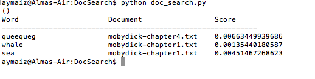

# Doc Search

When implementing text search over a corpus (a collection of documents), systems often rely in part on the term frequency (TF) of words in a document. A TF score is computed for each word (wi) in each document (dj) by computing the frequency of that word in that document. 

_______   
TF(wi, dj) = (number of times wi is found in dj) / (total number of words in dj)  
_______

## Original problem statement (implemented)
This program was developed for Python 2.7. It takes as input a list of documents and a list of words, and returns the document with the highest TF score for each word and the TF score for that word in that document.  
### Optional problem statement (implemented)
This program takes as input an AWS S3 location, and a list of words, and returns the document with the highest TF score for each word and the TF score for that word in that document.  

## How to run this program
Ensure the documents to search are available locally, or on S3 with the correct permissions and credentials set up locally and on S3 [AWS Documentation](https://aws.amazon.com/documentation/).   
#### For local documents:
Instantiate the Python class DocReporter, located in the file doc_reporter.py, and call the function #create_report_from_local_documents with the list of documents to be viewed and the words for reports as arguments.  
#### For S3 documents:  
Instantiate the Python class DocReporter, located in the file doc_reporter.py, and call the function #create_report_from_s3_documents with the s3 location bucket and the words for reports as arguments.       
### The output report
The create report functions both return a report of a list of tuples. For the assignment purposes the function also prints out a report table for each word given.  
### Example output
To print the assignment output run the Python script doc_search.py on the command line.  

  

## Discussion
This problem seems to best be solved where documents would be stored on a cloud service. I implemented a solution using AWS S3 initially for document access, and with the options to save the result on S3 and for initiating the calculations automatically.   

In preparation, as AWS Lambda would be used in this solution, I choose for this assignment to write my first ever Python program. I never implemented a solution where the output was stored on S3, but this submitted solution was adapted to run on AWS Lambda with CloudWatch taking the printed output. The AWS Lambda function used is attached to this submission.       

I had intended to implement the AWS Lambda solution using CloudFormation, and look forward to the opportunity next time.  

In coding using Ruby, I usually work using TDD, but it was difficult with Python as a new language. This submitted solution does however have tests to ensure refactoring mistakes were avoided and to raise the quality of the code.    

